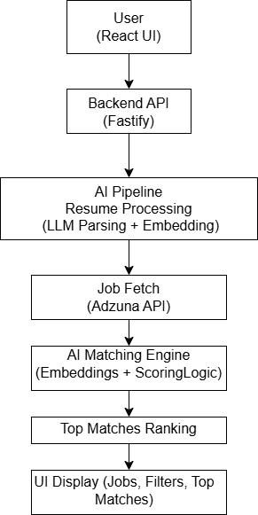
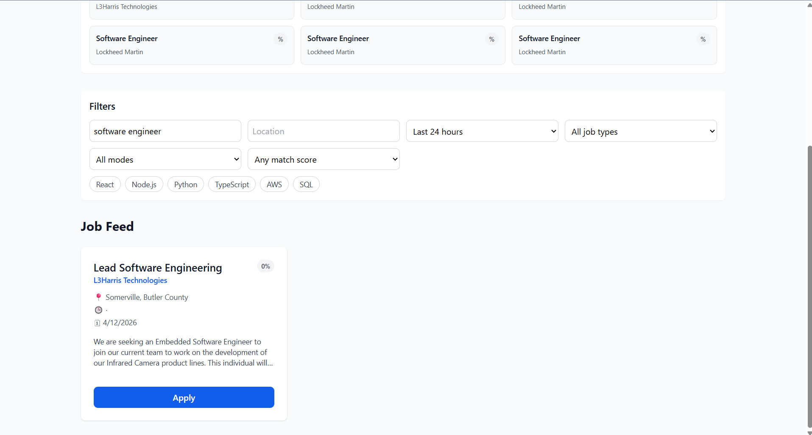

# AI-Powered Job Tracker with Smart Matching

A full-stack AI application that parses resumes, fetches real-time jobs, and ranks them using AI-based matching. The system includes filtering, top matches, and an AI assistant to control job preferences.

---

## 🚀 Live Demo
👉 https://zippy-quokka-0cd1c3.netlify.app/

## 📂 GitHub Repository
👉 https://github.com/DSatyakeerthi/ai-job-tracker

---

## 🔥 Key Features

- Resume parsing using LLM APIs
- AI-based job matching using embeddings and scoring
- Top Matches system to rank relevant jobs
- Job filtering (Last 24 hours / 1 week)
- AI assistant to update filters and preferences
- Real-time job data integration via external APIs
- Application tracking (Applied / Not Applied)

---

## 🧠 How AI is Used

- Resume is uploaded and processed using LLM APIs  
- Extracted data is structured into skills and experience  
- Jobs are fetched from external APIs  
- Matching is performed using:
  - Embeddings similarity  
  - Rule-based scoring  
  - LLM-assisted evaluation  
- Top matches are ranked and displayed to the user  

---

## 🏗️ System Architecture

👉 

**Flow:**
Resume → Parsing → Embedding → Job Fetch → Matching → Ranking → UI Display

---

## 🛠️ Tech Stack

**Frontend:**
- React
- JavaScript
- HTML/CSS

**Backend:**
- Fastify (Node.js)
- REST APIs

**AI / ML:**
- OpenAI API
- RAG (Retrieval-Augmented Generation)
- Embeddings

**Data & Processing:**
- JSON storage / In-memory processing
- Job API integration (Adzuna)

**Tools:**
- Windsurf (AI-assisted development)
- GitHub

---

## 📸 Screenshots

### Home / Job Listings

### Filtering (24 hours / 1 week)

---

## ⚡ Project Highlights

- Built a working AI system combining LLMs, APIs, and backend pipelines  
- Handles job matching across multiple listings using scoring logic  
- Uses caching and structured processing to improve performance  
- Designed modular architecture for scalability  

---

## 🚧 Future Improvements

- Add database (PostgreSQL / MongoDB)
- Improve UI/UX for better user experience
- Enhance matching accuracy with advanced ranking models
- Deploy at scale with cloud infrastructure (AWS / Render)

---

## 💡 Key Learnings

- Designing AI systems beyond simple API calls  
- Handling large data using chunking and pipelines  
- Improving AI output reliability using validation logic  
- Building end-to-end applications combining AI + backend + UI  

---

## 📬 Contact

LinkedIn: [Your LinkedIn Link]
Email: [Your Email]
